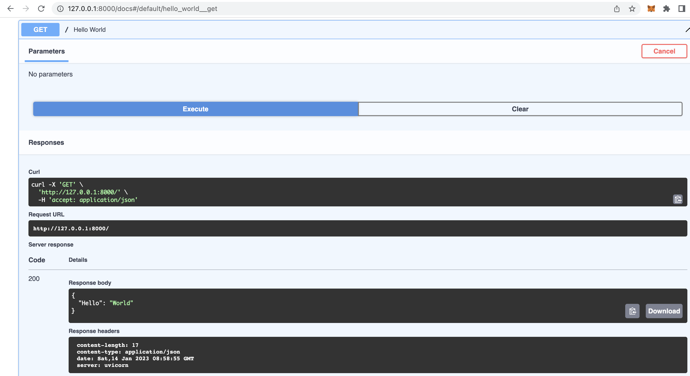

# Distributed_System_Course
## Part 1 - Getting Familiar with FastAPI
### Basic Installation
Framework: FastAPI
1. Install virtualenv (Optional) - If you do not want to install dependencies globally on to the computer.
```
pip3 install virtualenv
```

2. To make a virtual env
```
python3 -m venv env
source env/bin/activate
```

3. Install other dependencies
FastAPI
UviCorn - to create fast asgi server which basically run the fastapi application
```
pip3 install fastapi
pip3 install uvicorn 
```

4. Write the main application (main.py)

5. Run the server
```
uvicorn main:app --reload
```

6. To test whether it is running, go to browser and paste
```
http://127.0.0.1:8000
```

7. To go to the FastAPI swagger API go to 
```
http://127.0.0.1:8000/docs
```



8. FastAPI redoc (Read-Only)
```
http://127.0.0.1:8000/redoc
```

## Path Parameter and  Query Parameter
To test path paramentes:
```
http://127.0.0.1:8000/{url}/{parameter_name}
```
Example
```
http://127.0.0.1:8000/component/fastapi
http://127.0.0.1:8000/component/1
```
You can also test in FastAPI swagger UI
http://127.0.0.1:8000/docs

To test query parameters:
```
http://127.0.0.1:8000/{url}/{query}
```
Example:
```
http://127.0.0.1:8000/component/?number=3&text=test
```
You can also test in FastAPI swagger UI http://127.0.0.1:8000/docs  

If Optional field is used then the text field can left blank but the key has to be present
```
http://127.0.0.1:8000/component/?number=3&text=
```
http://127.0.0.1:8000/component/?number=3 will give error  

{"detail":[{"loc":["query","text"],"msg":"field required","type":"value_error.missing"}]}

## Pydantic BaseMode

Pydantic is a python library with data validations using type annotations.
To use pydantic in main1.py import the dependency
```
from pydantic import BaseModel
```
